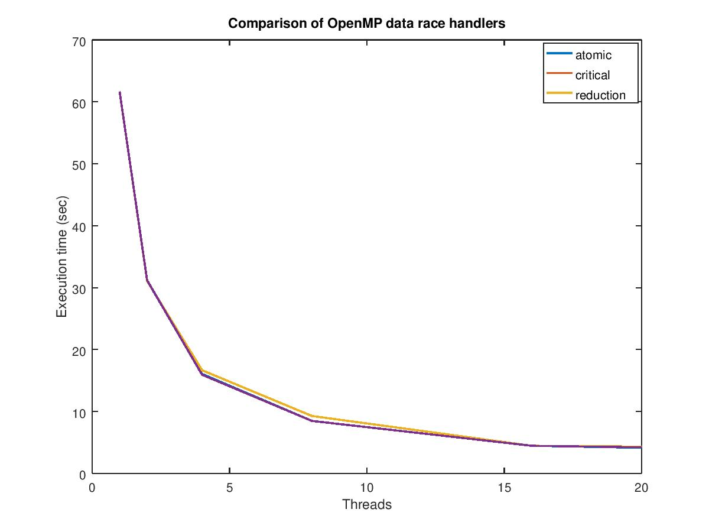

## Pi approximation

In this exercise we approximate pi using the mid point rule to approximate and
integral whose value is pi.

* [serial_pi.c](serial_pi.c) provides the serial implementation of the program.
* [parallel_pi.c](parallel_pi.c) provides the parallel implementation of the program
obtained from the serial version through the incremental approach of OpenMP.

In the parallel approximation of pi we used three different data race handlers:
* `critical`
* `atomic`
* `reduction`

The `omp critical` section is used to specify operations that must be performed
sequentially by threads to avoid data corruption. However, this is a quite
general block that can be used with any kind of operation. `omp atomic` on the
other hand supports only a set of limited operations and exploits hardware
capabilities to ensure data integrity. The last approach, `omp reduction`, instead
uses local partial results for each thread that are combined at the end of the
parallel section using the specified reduction operation.

To observe the different behavior of each approach we tested their scalability
running the program using a number of threads ranging from 1 to 20.

As can be seen in the above image, the time to result is pretty much the same in
all the three cases. However, we can appreciate the fact that they scale well as
the number of threads is increased.
