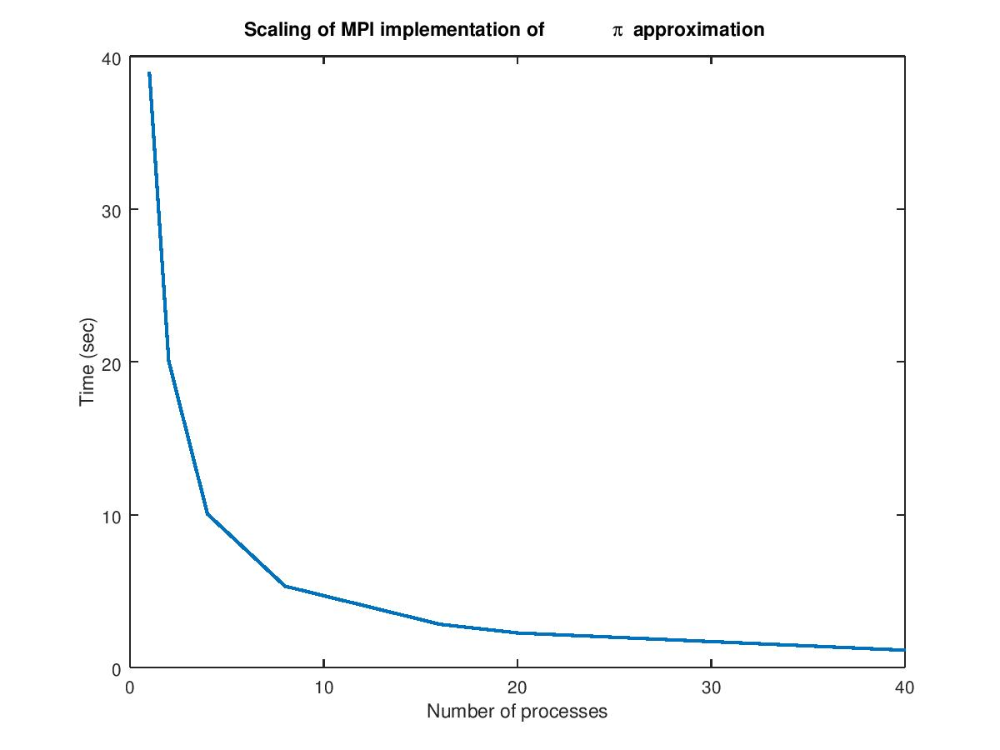
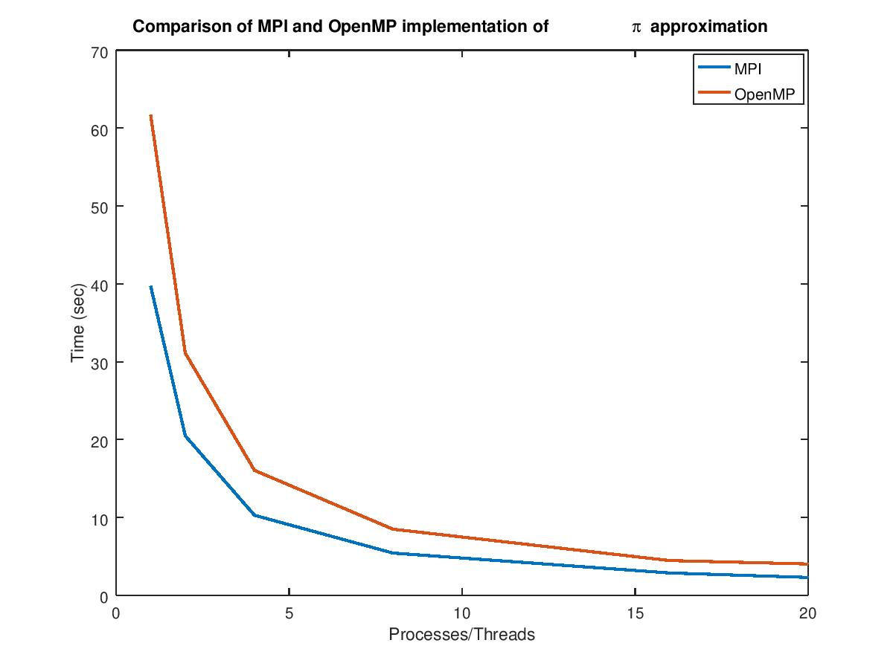

## Pi approximation with MPI

In this exercise we approximate pi using a parallel approach based on MPI.
[pi_mpi.c](pi_mpi.c) provides the implementation of the program.

We tested the scalability of the program running it with a number of processes
ranging from 1 to 40 and using `10^10` breaks in the `[0,1]` interval to
approximate pi. The resulting times are the following:

We can see that the the code scales pretty well as the number of processes is
increased.

### MPI vs OpenMP
We also compared the MPI implementation above with the previous version of the
program obtained using OpenMP. Again the two programs have been tested one against
the other using a number of processes/threads ranging from 1 to 20, for MPI and
OpenMP, respectively.

As we can see from the plot the MPI implementation seems to be faster than the
other one.

## Compiling 
To compile the program just call `make`.
