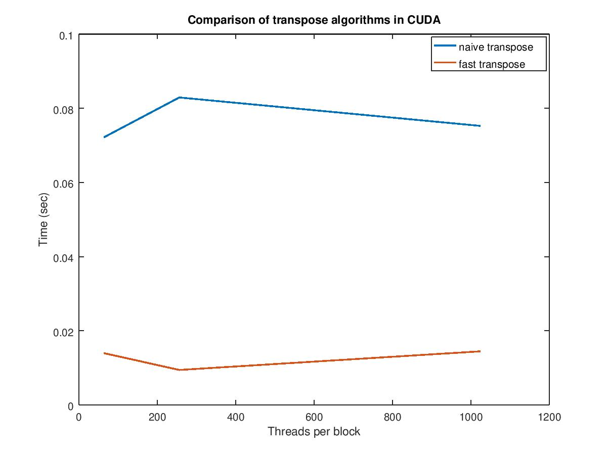

# Matrix transpose

In this exercise we implement in CUDA two algorithms to transpose a matrix. The
first one (naive) just distributes the rows of the matrix among thread blocks
and each one transposes its row. The second one (fast transpose) exploits the
memory hierarchy in the GPU and assigns to each thread block a sub-matrix to be
transposed locally. Each block of threads transposes its local sub-matrix and
copies it into the transposed matrix.

Both algorithms have been tested for different block sizes (64, 256 and 1024) and
we obtained the following results:

It can be seen that the fast transpose algorithm is faster than the naive.
Furthermore, we can observe that for the former one the best value for the number
of threads in a block seems to be in the middle between 64 and 1024 while for the
latter one the best value appears to be 64.
